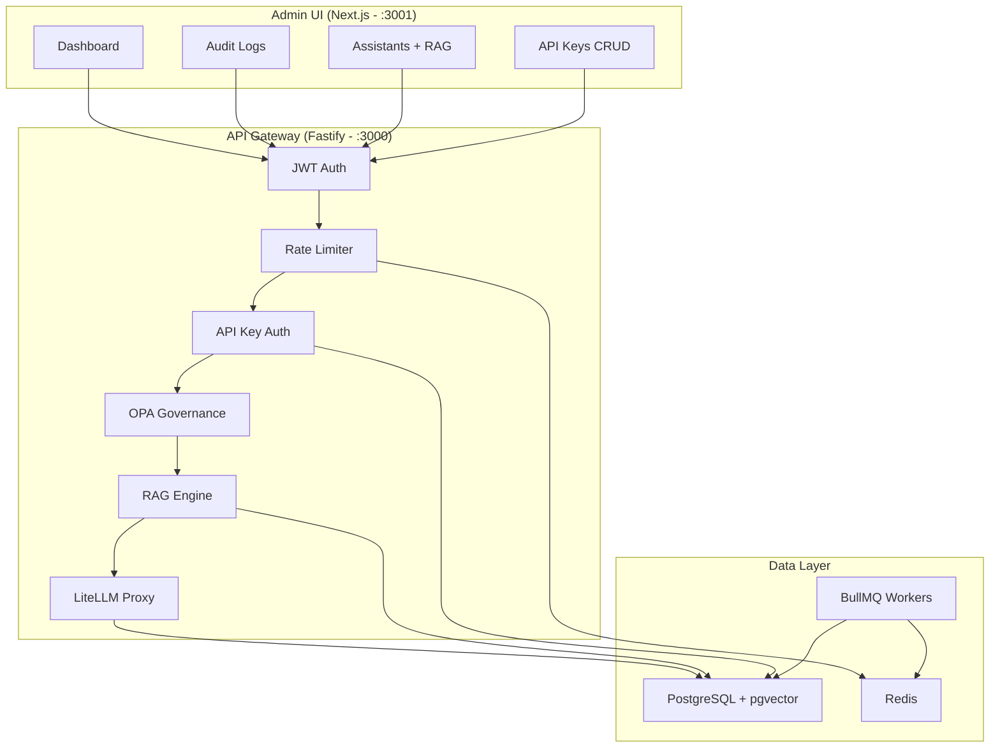

# 🏛️ GovAI Platform

**Enterprise AI Governance Platform** — Uma plataforma completa de governança para IA corporativa, integrando autenticação multi-camada, auditoria imutável com assinaturas digitais, RAG (Retrieval-Augmented Generation), filtragem de políticas OPA e um painel administrativo Next.js.


---

## 📐 Arquitetura



---

## 🚀 Quick Start

### Pré-requisitos
- [Docker Desktop](https://www.docker.com/products/docker-desktop/) (v20+)
- [Docker Compose](https://docs.docker.com/compose/) (v2+)

### 1. Clonar o repositório
```bash
git clone https://github.com/mauriciodesouzaads/GovAIPlatform.git
cd GovAIPlatform
```

### 2. Configurar variáveis de ambiente
```bash
cp .env.example .env
# Edite o .env e configure sua GEMINI_API_KEY
```

### 3. Subir toda a stack
```bash
docker-compose up --build -d
```

### 4. Acessar
| Serviço | URL |
|---|---|
| **Admin Panel** | [http://localhost:3001](http://localhost:3001) |
| **API Gateway** | [http://localhost:3000](http://localhost:3000) |
| **Health Check** | [http://localhost:3000/health](http://localhost:3000/health) |

### 5. Credenciais padrão
| Campo | Valor |
|---|---|
| Email | `admin@govai.com` |
| Senha | `admin` |

> ⚠️ **Importante:** Altere as credenciais padrão definindo `ADMIN_EMAIL` e `ADMIN_PASSWORD` nas variáveis de ambiente em produção.

---

## 🧩 Stack Tecnológica

| Camada | Tecnologia |
|---|---|
| **Backend** | Fastify 5, TypeScript 5, Node.js 20 |
| **Frontend** | Next.js 16 (Turbopack), Tailwind CSS, Recharts, Lucide React |
| **Banco de Dados** | PostgreSQL 15 + pgvector (HNSW index) |
| **Cache/Queue** | Redis 7, BullMQ |
| **AI Proxy** | LiteLLM (Gemini, OpenAI, Anthropic, etc.) |
| **Embeddings** | Gemini Embedding API (`gemini-embedding-001`, 3072 dims) |
| **Governança** | Open Policy Agent (OPA) — mock + WASM ready |
| **Testes** | Vitest |
| **Containers** | Docker Compose (5 serviços) |

---

## 🔐 Segurança

### Autenticação Multi-Camada
1. **JWT (Admin Panel):** Login gera token JWT com 8h de expiração. Todas as 9 rotas admin são protegidas via `preHandler: requireAdminAuth`.
2. **API Keys (Execução de IA):** Chaves `sk-govai-*` são validadas via hash SHA-256 (HMAC) contra o banco. A chave nunca é armazenada em texto claro.

### Isolamento por Organização
- **Row Level Security (RLS):** Habilitado em 4 tabelas (`api_keys`, `assistants`, `knowledge_bases`, `audit_logs_partitioned`).
- **Particionamento por Tenant:** Audit logs são particionados por `org_id` com criação automática de partições via trigger.

### Auditoria Imutável
- Cada execução e violação gera um log com assinatura digital **HMAC-SHA256**.
- Trigger de imutabilidade: `UPDATE` e `DELETE` são bloqueados na tabela de logs.
- Verificação de integridade: O worker re-verifica a assinatura antes da inserção.

### Proteções Adicionais
- **Rate Limiting:** 100 req/min por API key, via Redis.
- **CORS Restrito:** Apenas Admin UI autorizado.
- **Input Validation:** Todos os payloads validados com Zod schemas.

---

## 🤖 RAG (Retrieval-Augmented Generation)

O sistema permite alimentar assistentes de IA com documentos proprietários.

### Fluxo
1. **Upload** → Documento é recebido via API
2. **Chunking** → Texto é particionado (~500 chars, respeitando limites de sentenças)
3. **Embedding** → Cada chunk é vetorizado via Gemini API (3072 dims)
4. **Storage** → Vetores armazenados no PostgreSQL com pgvector
5. **Search** → Busca por similaridade cosseno com índice HNSW (sub-linear)
6. **Injection** → Chunks relevantes são injetados como contexto no prompt da IA

### Performance
- Índice **HNSW** (`m=16, ef_construction=64`) para busca vetorial em milissegundos
- Índice **B-tree** em `kb_id` para filtragem rápida por base de conhecimento

---

## 🛡️ Governança OPA

O filtro de políticas intercepta cada requisição antes da execução da IA:

| Regra | Descrição |
|---|---|
| **PII Filter** | Bloqueia inputs contendo CPFs (Regex) |
| **Topic Blacklist** | Bloqueia assuntos proibidos (`hack`, `bypass`) |
| **Jailbreak Prevention** | Detecta tentativas de evasão (`ignore previous`, `admin mode`) |
| **Prompt Injection** | Bloqueia frases como `forget your safety guidelines` |

O engine suporta carregamento de políticas WASM reais via OPA para produção.

---

## 📊 Admin Panel

| Página | Funcionalidades |
|---|---|
| **Dashboard** | Métricas em tempo real, gráficos Recharts (uso vs violações), tracking de tokens e custos |
| **Audit Logs** | Tabela com modal detalhado (TraceID, payload, assinatura SHA-256, JSON completo) |
| **Assistants & RAG** | CRUD de assistentes + upload de documentos para vetorização |
| **API Keys** | Gerar, listar e revogar chaves de acesso |

---

## ⚙️ Variáveis de Ambiente

| Variável | Descrição | Default |
|---|---|---|
| `GEMINI_API_KEY` | Chave da API Google Gemini | *(obrigatório)* |
| `DB_PASSWORD` | Senha do PostgreSQL | `senha_forte_postgres` |
| `SIGNING_SECRET` | Chave para assinaturas HMAC-SHA256 | *(obrigatório)* |
| `AI_MODEL` | Modelo de IA via LiteLLM | `gemini/gemini-1.5-flash` |
| `JWT_SECRET` | Secret para tokens JWT | Auto-gerado |
| `ADMIN_EMAIL` | Email de login admin | `admin@govai.com` |
| `ADMIN_PASSWORD` | Senha de login admin | `admin` |
| `ADMIN_UI_ORIGIN` | Domínio permitido para CORS | `http://localhost:3001` |
| `REDIS_URL` | URL do Redis | `redis://redis:6379` |
| `LOG_LEVEL` | Nível de log (debug/info/warn) | `info` |

---

## 🧪 Testes

```bash
# Rodar testes unitários
npm run test

# Rodar dentro do container
docker exec govai-platform-api-1 npm run test
```

---

## 📁 Estrutura do Projeto

```
govai-platform/
├── admin-ui/                    # Frontend Next.js
│   ├── src/
│   │   ├── app/
│   │   │   ├── page.tsx         # Dashboard
│   │   │   ├── login/           # Tela de Login JWT
│   │   │   ├── logs/            # Audit Logs
│   │   │   ├── assistants/      # Assistants + RAG Upload
│   │   │   ├── api-keys/        # API Keys CRUD
│   │   │   └── layout.tsx       # Root layout
│   │   ├── components/
│   │   │   ├── AuthProvider.tsx  # JWT context
│   │   │   ├── Sidebar.tsx      # Navigation + Logout
│   │   │   └── LayoutWrapper.tsx # Conditional sidebar
│   │   └── lib/
│   │       ├── api.ts           # Centralized API_BASE config
│   │       └── utils.ts         # Utility functions
│   └── Dockerfile.admin
├── src/
│   ├── server.ts                # Fastify API (558 lines)
│   ├── lib/
│   │   ├── governance.ts        # Zod schemas + HMAC + GovernanceEngine
│   │   ├── opa-governance.ts    # OPA Policy Engine (WASM + mock)
│   │   └── rag.ts               # RAG Engine (chunk, embed, search)
│   ├── workers/
│   │   └── audit.worker.ts      # BullMQ audit log worker
│   └── __tests__/
│       └── rag.test.ts          # Vitest unit tests
├── docker-compose.yml           # 5 serviços orquestrados
├── Dockerfile                   # API container
├── init.sql                     # Schema + RLS + Triggers + Indexes
├── litellm-config.yaml          # LiteLLM AI proxy config
├── .env                         # Environment variables
├── .gitignore
├── tsconfig.json
└── package.json
```

---

## 📝 Licença

MIT License — Uso livre para fins acadêmicos e comerciais.

---

## 👤 Autor

**Maurício de Souza**  
[GitHub](https://github.com/mauriciodesouzaads) • [GovAI Platform](https://github.com/mauriciodesouzaads/GovAIPlatform)
