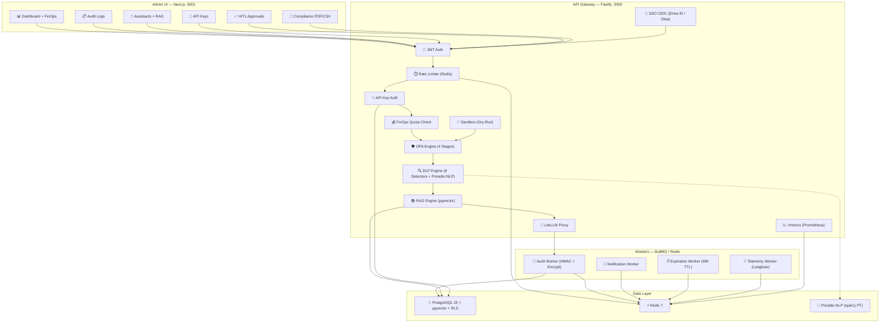

# 🏛️ GOVERN.AI Platform

**Enterprise AI Governance Platform** — Plataforma blindada de governança corporativa para agentes de IA, com SSO federado, criptografia BYOK, motor OPA de 4 estágios, DLP semântico, filas assíncronas, RAG vetorial e portal para programadores.


---

## 📚 Documentação e Manuais

Para uma compreensão aprofundada da plataforma, arquitetura de segurança, auditoria e operações do dia-a-dia, consulte os documentos detalhados gerados para o projeto:
* 🏛️ [Dossiê Técnico e Visão Executiva](./docs/dossie_tecnico.md)
* 🚀 [Manual de Instalação e Implantação](./docs/manual_implantacao.md)
* 🛠️ [Manual de Operação e Manutenção (SRE/SecOps)](./docs/manual_manutencao.md)

---

## 📐 Arquitetura



---

## 🏗️ 10 Pilares Arquitecturais

| # | Pilar | Descrição | Sprint |
|---|---|---|---|
| 1 | **Cartório Digital** | Versionamento imutável de agentes e políticas | S1 |
| 2 | **Portagem (OPA + DLP + HITL)** | Motor de governança de 4 estágios com Human-in-the-Loop | S1 |
| 3 | **MCP (Model Context Protocol)** | Alvarás Zero-Trust para ferramentas externas + Rollback atómico | S2 |
| 4 | **SSO Corporativo** | Entra ID / Okta com JIT Provisioning + Rate Limiting Redis | S3 |
| 5 | **Caixa Negra (BYOK)** | AES-256-GCM + Crypto-Shredding + HMAC-SHA256 | S4 |
| 6 | **Observabilidade** | Langfuse + Presidio NLP (spaCy PT) container | S5 |
| 7 | **FinOps & Quotas** | Hard/Soft Caps por agente, token ledger append-only | B2B |
| 8 | **Portal DX** | OpenAPI 3.0.3 + Sandbox dry-run (OPA+DLP sem LLM) | B2B |
| 9 | **SRE Prometheus** | 8 métricas em formato text exposition para Grafana | B2B |
| 10 | **Offboarding** | Export JSON/CSV de 12 tabelas + PDF Due Diligence | B2B |

---

## 🚀 Quick Start

### Pré-requisitos
- [Docker Desktop](https://www.docker.com/products/docker-desktop/) (v20+)
- [Docker Compose](https://docs.docker.com/compose/) (v2+)

### 1. Clonar e configurar
```bash
git clone https://github.com/mauriciodesouzaads/GovAIPlatform.git
cd GovAIPlatform
cp .env.example .env
# Edite o .env e configure suas chaves (GEMINI_API_KEY, SIGNING_SECRET, etc.)
```

### 2. Subir toda a stack
```bash
docker compose up --build -d
```

### 3. Executar migrations
```bash
# Executa as migrations sequencialmente até a 020
docker exec govai-platform-api-1 bash scripts/migrate.sh
```

### 4. Acessar

| Serviço | URL |
|---|---|
| **Admin Panel** | [http://localhost:3001](http://localhost:3001) |
| **API Gateway** | [http://localhost:3000](http://localhost:3000) |
| **Health Check** | [http://localhost:3000/health](http://localhost:3000/health) |
| **Prometheus Metrics** | [http://localhost:3000/metrics](http://localhost:3000/metrics) |
| **OpenAPI Spec** | [http://localhost:3000/v1/docs/openapi.json](http://localhost:3000/v1/docs/openapi.json) |
| **Sandbox (DX)** | `POST http://localhost:3000/v1/sandbox/execute` |

### 5. Credenciais padrão
| Campo | Valor |
|---|---|
| Email | `admin@govai.com` |
| Senha | `admin` |

> ⚠️ **Produção:** Altere `ADMIN_EMAIL`, `ADMIN_PASSWORD`, `SIGNING_SECRET` e `JWT_SECRET` nas variáveis de ambiente.

---

## 🧩 Stack Tecnológica

| Camada | Tecnologia |
|---|---|
| **Backend** | Fastify 5, TypeScript 5, Node.js 20 |
| **Frontend** | Next.js 16 (Turbopack), Tailwind CSS, Recharts, Lucide React |
| **Banco de Dados** | PostgreSQL 15 + pgvector (HNSW index) + RLS |
| **Cache/Queue** | Redis 7, BullMQ (4 workers) |
| **AI Proxy** | LiteLLM (Gemini, OpenAI, Anthropic, etc.) |
| **SSO** | OpenID Connect (Entra ID, Okta) via `openid-client` |
| **Criptografia** | AES-256-GCM (BYOK), HMAC-SHA256 |
| **DLP** | 9 detetores regex + Presidio NLP (spaCy PT) |
| **Governança** | OPA (4 estágios: DLP → Blacklist → Injection → HITL) |
| **Observabilidade** | Langfuse, Prometheus metrics |
| **Testes** | Vitest, Supertest (173 testes, 19 ficheiros) |
| **Containers** | Docker Compose (6 serviços) |

---

## 🔐 Segurança

### Autenticação Multi-Camada
| Método | Contexto |
|---|---|
| **JWT** | Admin Panel (8h de expiração) |
| **API Keys** | Execução de IA (`sk-govai-*`, hash SHA-256, nunca armazenada em claro) |
| **SSO OIDC** | Enterprise (Entra ID / Okta com JIT Provisioning automático) |

### Motor OPA — 4 Estágios

```
Prompt → DLP (PII) → Blacklist → Injection Prevention → HITL → LLM
                                                         ↓
                                                   ⏱️ 48h TTL
```

| Estágio | Ação | Resultado |
|---|---|---|
| 1. **DLP/PII** | CPF, CNPJ, Email, PIX, CEP, RG, Luhn (cartão), Presidio NLP | `FLAG` |
| 2. **Blacklist** | Tópicos proibidos configuráveis | `BLOCK` |
| 3. **Injection** | "ignore previous", "bypass" (Motor OPA WASM Nativo) | `BLOCK` |
| 4. **HITL** | Palavras de alto risco (financeiros, transferência) | `PENDING_APPROVAL` |

### Caixa Negra (BYOK)
- **AES-256-GCM** com IV aleatório por operação (sem Rainbow Tables)
- **Crypto-Shredding:** Revogação de chave = dados irrecuperáveis
- **HMAC-SHA256:** Assinatura digital em todos os audit logs
- **Isolamento por Tenant:** Chaves mestras e assinaturas são scoped por `org_id`

### Row Level Security (RLS)
Habilitado em **todas** as tabelas com dados sensíveis. Contexto `app.current_org_id` é definido em cada transação PostgreSQL.

---

## 🛣️ API Endpoints

| Método | Endpoint | Auth | Descrição |
|---|---|---|---|
| `POST` | `/v1/execute/:assistantId` | API Key | Execução governada (OPA→DLP→LLM) |
| `POST` | `/v1/sandbox/execute` | — | Dry-run OPA+DLP (sem LLM, sem custo) |
| `GET` | `/v1/docs/openapi.json` | — | Spec OpenAPI 3.0.3 |
| `GET` | `/v1/auth/sso/login` | — | SSO OIDC redirect |
| `GET` | `/v1/auth/sso/callback` | — | SSO callback + JIT |
| `POST` | `/v1/admin/login` | — | Admin JWT login |
| `GET` | `/v1/admin/stats` | JWT | Dashboard KPIs + FinOps |
| `GET` | `/v1/admin/logs` | JWT | Audit logs paginados |
| `GET/POST` | `/v1/admin/assistants` | JWT | CRUD agentes + versões |
| `GET/POST/DEL` | `/v1/admin/api-keys` | JWT | Gestão API Keys |
| `GET/POST` | `/v1/admin/approvals` | JWT | HITL approve/reject |
| `GET` | `/v1/admin/reports/compliance` | JWT | PDF BCB 4.557 / CSV |
| `GET` | `/v1/admin/export/tenant` | JWT | Offboarding JSON/CSV |
| `GET` | `/v1/admin/export/due-diligence` | JWT | PDF Security Due Diligence |
| `GET` | `/health` | — | Health check |
| `GET` | `/metrics` | — | Prometheus text format |

---

## 🧪 Testes — 173/173 ✅

```bash
# Local
npm run test

# Docker
docker exec govai-platform-api-1 npm run test
```

| Suite | Testes | Domínio |
|---|---|---|
| DLP Core + Extended | 33 | CPF, CNPJ, Luhn, Email, PIX, CEP, RG, overlap, sanitize |
| OPA Governance | 15 | 4 estágios, precedência, injection, HITL |
| Governance Core | 20 | HMAC, Zod, ActionType |
| RAG Engine | 15 | Token budgeting, chunking, overlap |
| 🔒 Crypto/BYOK | 11 | Crypto-shredding, Rainbow, HMAC tamper |
| 🔒 DLP/HITL | 9 | Falsos positivos, Race 409, TTL |
| 🔒 MCP | 8 | Alvará Zero-Trust, Partial-Match, Rollback |
| 🔒 RLS | 7 | Cross-tenant, MCP escalation, BYOK |
| 🔒 SSO | 7 | JIT, Idempotência, Okta, rate limit |
| 🚀 E2E | 12 | Auth, API key, rate-limit 429, 404 |
| 💰 B2B Pillars | 17 | FinOps, Sandbox, Prometheus, Offboarding |
| 🐘 E2E-PG + Presidio | 8 | Transações RLS, rollback, NLP |

---

## 📁 Estrutura do Projeto

```
govai-platform/
├── admin-ui/                        # Frontend Next.js (13 componentes)
│   └── src/app/
│       ├── page.tsx                 # Dashboard + FinOps tooltips
│       ├── logs/                    # Audit Logs
│       ├── assistants/              # Assistants + RAG + MCP
│       ├── approvals/               # Human-in-the-Loop
│       ├── api-keys/                # API Keys CRUD
│       ├── reports/                 # Compliance PDF/CSV
│       └── login/                   # JWT + SSO Login
├── src/
│   ├── server.ts                    # Fastify orchestrator (503 lines)
│   ├── routes/
│   │   ├── admin.routes.ts          # Auth, Stats, Logs (156 lines)
│   │   ├── assistants.routes.ts     # Agentes, API Keys, MCP, RAG
│   │   ├── approvals.routes.ts      # HITL approve/reject
│   │   └── reports.routes.ts        # Compliance PDF + CSV
│   ├── lib/
│   │   ├── opa-governance.ts        # OPA Engine (4 stages)
│   │   ├── dlp-engine.ts            # 9 detectors + Presidio hook
│   │   ├── crypto-service.ts        # AES-256-GCM (BYOK)
│   │   ├── auth-oidc.ts             # SSO OIDC + Redis rate-limiter
│   │   ├── rag.ts                   # RAG (pgvector + token budgeting)
│   │   ├── finops.ts                # Quota enforcement (hard/soft)
│   │   ├── sre-metrics.ts           # Prometheus metrics (8 gauges)
│   │   ├── offboarding.ts           # Tenant export + Due Diligence PDF
│   │   ├── compliance-report.ts     # BCB 4.557 PDF generator
│   │   ├── governance.ts            # HMAC + Zod schemas
│   │   └── mcp.ts                   # MCP Zod schemas
│   ├── workers/
│   │   ├── audit.worker.ts          # HMAC + AES encrypt
│   │   ├── notification.worker.ts   # Webhook + email
│   │   ├── expiration.worker.ts     # CRON PENDING > 48h
│   │   └── telemetry.worker.ts      # Langfuse fire-and-forget
│   └── __tests__/                   # 19 test files (173 tests)
├── presidio/
│   ├── Dockerfile                   # Python 3.11 + spaCy PT
│   └── app.py                       # FastAPI /analyze + /anonymize
├── scripts/
│   └── migrate.sh                   # Sequential migration runner
├── *.sql                            # 10 migrations (init + 011-020)
├── docker-compose.yml               # 6 services orchestrated
├── Dockerfile                       # Multi-stage API build
├── .env.example                     # 20+ environment variables
└── package.json
```

---

## ⚙️ Variáveis de Ambiente

| Variável | Descrição | Default |
|---|---|---|
| `GEMINI_API_KEY` | Chave API Google Gemini | *(obrigatório)* |
| `SIGNING_SECRET` | Chave HMAC-SHA256 para auditoria | *(obrigatório)* |
| `JWT_SECRET` | Secret JWT para Admin Panel | Auto-gerado |
| `DB_PASSWORD` | Senha PostgreSQL | `senha_forte_postgres` |
| `REDIS_URL` | URL do Redis | `redis://redis:6379` |
| `AI_MODEL` | Modelo IA via LiteLLM | `gemini/gemini-1.5-flash` |
| `ADMIN_EMAIL` | Email admin | `admin@govai.com` |
| `ADMIN_PASSWORD` | Senha admin | `admin` |
| `ORG_MASTER_KEY` | Chave mestra BYOK (32 chars) | *(obrigatório prod)* |
| `OIDC_ISSUER_URL` | URL do Identity Provider OIDC | — |
| `OIDC_CLIENT_ID` | Client ID do SSO | — |
| `OIDC_CLIENT_SECRET` | Client Secret do SSO | — |
| `OIDC_REDIRECT_URI` | Callback URL SSO | — |
| `LANGFUSE_PUBLIC_KEY` | Langfuse observability | — |
| `LANGFUSE_SECRET_KEY` | Langfuse secret | — |
| `LANGFUSE_HOST` | Langfuse endpoint | — |
| `PRESIDIO_URL` | URL do Presidio NLP | `http://presidio:5002` |
| `ADMIN_UI_ORIGIN` | CORS origin | `http://localhost:3001` |
| `LOG_LEVEL` | Nível de log | `info` |

---

## 📝 Licença

MIT License — Uso livre para fins acadêmicos e comerciais.

---

## 👤 Autor

**Maurício de Souza**  
[GitHub](https://github.com/mauriciodesouzaads) • [GOVERN.AI Platform](https://github.com/mauriciodesouzaads/GovAIPlatform)
