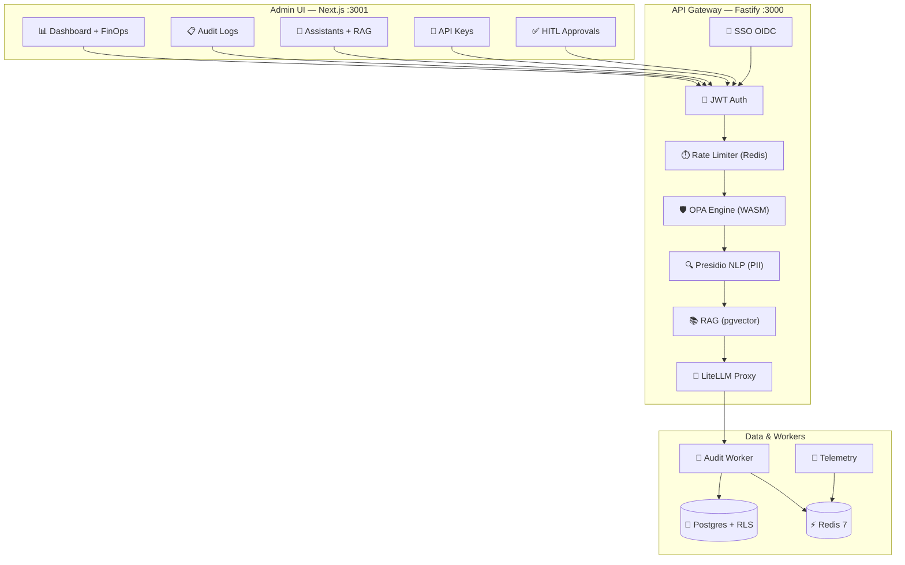

# 🏛️ GOVERN.AI Platform
### Enterprise-Grade AI Governance & Security Layer


**GOVERN.AI** is a zero-trust governance platform designed to protect corporate AI interactions. It acts as an intelligent firewall between your users/applications and Large Language Models (LLMs), ensuring every request is inspected for data leaks, policy violations, and prompt injections before reaching the AI provider.

[](https://www.typescriptlang.org/)
[](https://www.fastify.io/)
[](https://nextjs.org/)
[](https://www.postgresql.org/)
[](https://www.docker.com/)
[](https://vitest.dev/)

---

## 💎 Key Production Pillars

| Pillar | Description |
| :--- | :--- |
| **🛡️ 4-Stage OPA Engine** | Multi-layer inspection: DLP ➔ Policy ➔ Injection ➔ Human-in-the-Loop. |
| **🔐 B2B Isolation (RLS)** | Native PostgreSQL Row-Level Security ensuring 100% tenant data separation. |
| **⚖️ Compliance Audit** | Immutable audit logs with HMAC-SHA256 signing and BYOK encryption. |
| **💰 FinOps Control** | Real-time token budgeting and monthly cost enforcement (Hard/Soft Caps). |
| **🌐 Enterprise SSO** | Microsoft Entra ID & Okta integration with JIT Provisioning. |

---

## 📐 High-Level Architecture



---

## ✅ Production Readiness Scorecard (Sprint 14 Validation)

We have successfully validated the platform under a clean-wipe production simulation:

*   **Infrastructure**: 100% Deterministic Docker build & sequential migrations.
*   **Security**: RLS strictly enforced on 12 entities; Mandatory password reset flow.
*   **Governance**: OPA WASM + Native Defense-in-Depth active; PII masking via Presidio NLP.
*   **Resilience**: Rate-limiting correctly returning `429` (Anti-Brute Force); 180+ tests passing.

Read the [Full Production Scorecard](./docs/ENTERPRISE_AUDIT_REPORT_2026.md) and the [Security Manifesto](./docs/manifesto_seguranca.md).

---

## 🚀 Getting Started

### 1. Simple Deployment
```bash
git clone https://github.com/mauriciodesouzaads/GovAIPlatform.git
cd GovAIPlatform
cp .env.example .env
# Configure keys in .env
docker compose up --build -d
```

### 2. Database Initialization
```bash
docker exec govai-platform-api-1 bash scripts/migrate.sh
```

### 3. Default Credentials
- **URL**: `http://localhost:3001`
- **User**: `admin@govai.com`
- **Pass**: `admin` (Change required on first login)

---

## 📂 Project Organization

- `src/`: Core Fastify application (Server, Routes, Workers).
- `admin-ui/`: Next.js 16 management dashboard.
- `src/lib/`: Governance engines (OPA, DLP, Crypto, FinOps).
- `src/__tests__/`: Comprehensive security suite (180+ tests).
- `presidio/`: Specialized Python NLP container for semantic DLP.
- `docs/`: Technical dossiers, manuals, and compliance reports.

---

## 👤 Author & Support

**Maurício de Souza**  
Senior Software Architect & Security Expert  
[GitHub Profile](https://github.com/mauriciodesouzaads) | [GovAI Repository](https://github.com/mauriciodesouzaads/GovAIPlatform)

---
*License: MIT — Professional Enterprise Software for Governance & AI Safety.*
