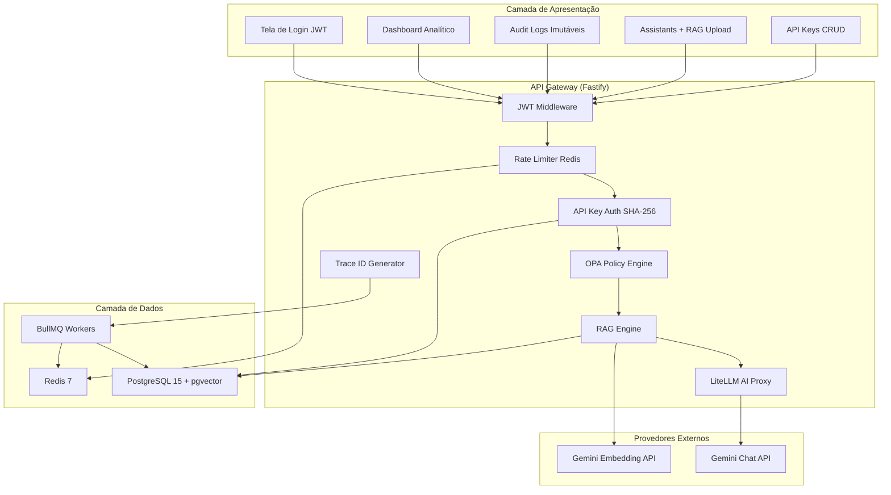
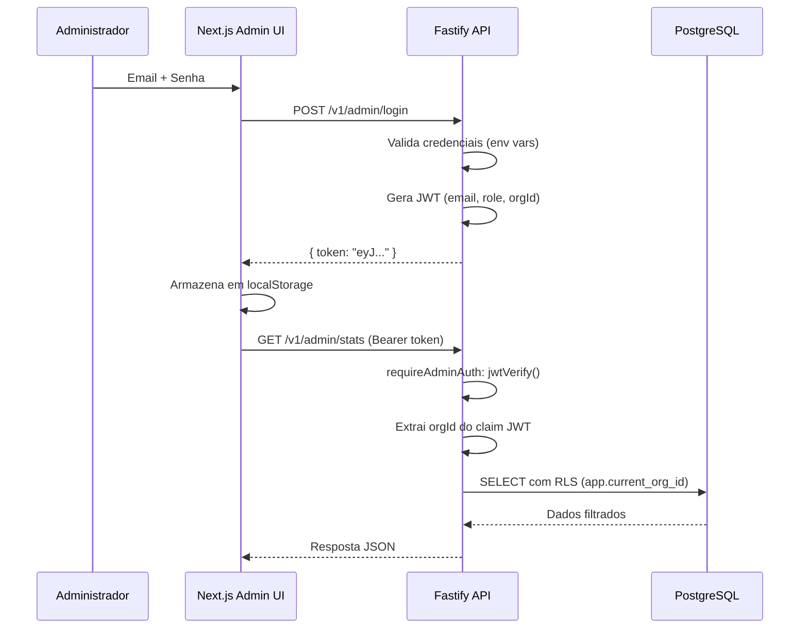
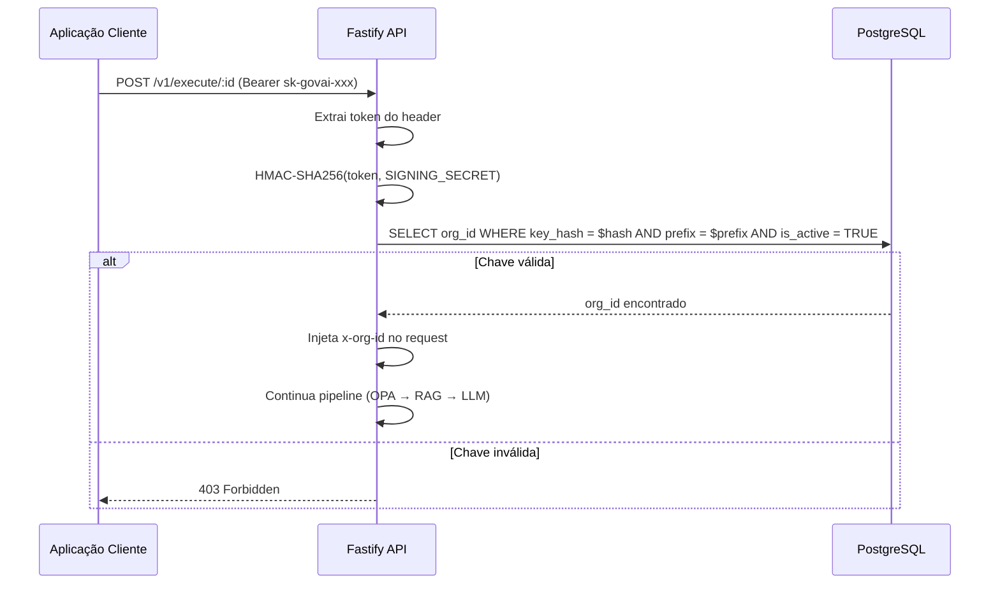
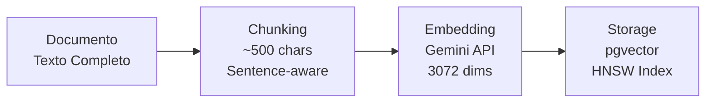
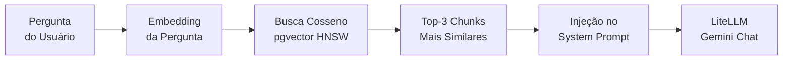
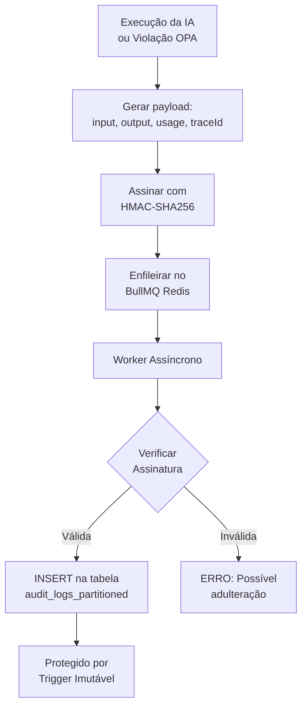
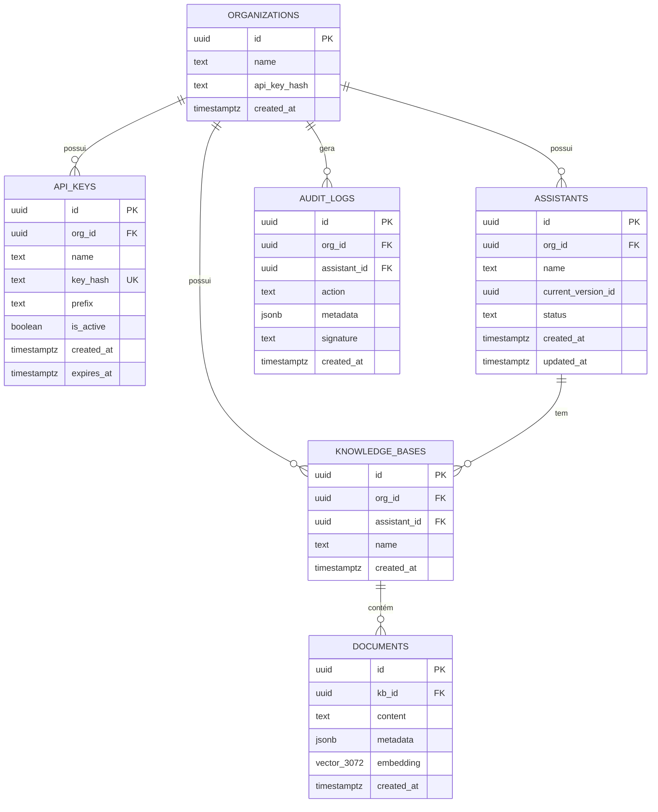
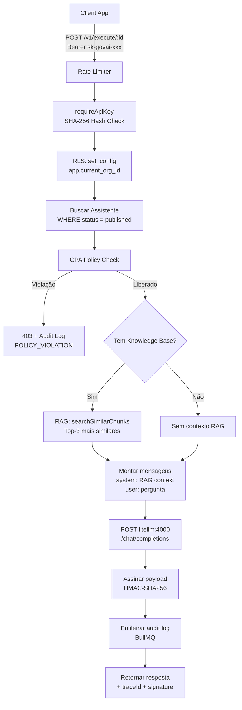
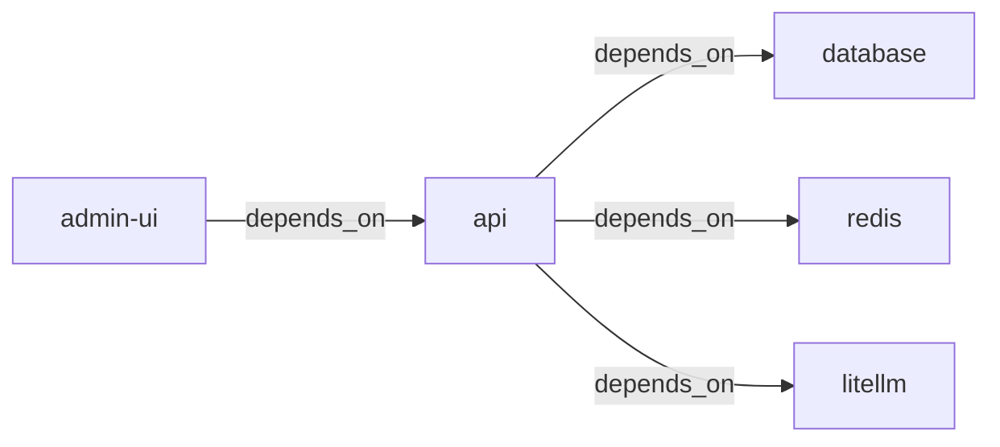

# GovAI Platform — Relatório Técnico Completo

**Documento de Arquitetura, Operação e Integração**  
**Versão:** 1.0  
**Data:** 03 de Março de 2026  
**Autor:** Maurício de Souza  
**Repositório:** [github.com/mauriciodesouzaads/GovAIPlatform](https://github.com/mauriciodesouzaads/GovAIPlatform)

---

## Sumário Executivo

A **GovAI Platform** é uma plataforma enterprise de governança para Inteligência Artificial, desenvolvida para organizações que precisam utilizar modelos de linguagem (LLMs) em ambientes regulados e corporativos. A plataforma resolve o problema central de **como permitir que organizações usem IA generativa mantendo controle total sobre segurança, compliance, auditoria e rastreabilidade**.

O sistema atua como um **gateway inteligente** entre as aplicações corporativas e os provedores de IA (como Google Gemini, OpenAI, Anthropic), adicionando camadas de autenticação, validação de políticas, filtragem de conteúdo, enriquecimento de contexto (RAG) e auditoria imutável a cada interação.

### Público-Alvo
- Bancos, fintechs e instituições financeiras
- Órgãos governamentais com requisitos de compliance
- Empresas de saúde com regulamentações de privacidade
- Qualquer organização multi-tenant que necessite governar o uso de IA

---

## 1. Visão Geral da Arquitetura

### 1.1 Diagrama Arquitetural



### 1.2 Modelo de Comunicação

A comunicação entre os componentes é feita exclusivamente via REST/HTTP internamente na rede Docker (`govai-net`). Os serviços se comunicam usando nomes de serviço DNS (ex: `http://litellm:4000`, `redis://redis:6379`, `postgresql://database:5432`).

| Origem | Destino | Protocolo | Porta |
|---|---|---|---|
| Browser → Admin UI | HTTP | 3001 |
| Admin UI → API | HTTP REST | 3000 |
| API → LiteLLM | HTTP REST | 4000 |
| API → PostgreSQL | TCP (pg) | 5432 |
| API → Redis | TCP (ioredis) | 6379 |
| API → Gemini Embed API | HTTPS | 443 |
| LiteLLM → Gemini Chat API | HTTPS | 443 |

---

## 2. Stack Tecnológica Detalhada

### 2.1 Backend — API Gateway

| Componente | Tecnologia | Versão | Finalidade |
|---|---|---|---|
| Runtime | Node.js | 20 (Alpine) | Execução server-side |
| Framework HTTP | Fastify | 5.0 | Servidor HTTP de alta performance (até 30k req/s) |
| Linguagem | TypeScript | 5.0 | Tipagem estática e IntelliSense |
| Compilador | tsc (TypeScript Compiler) | 5.0 | Target ES2020, módulos CommonJS |
| Validação | Zod | 4.3 | Schema validation de inputs com type inference |
| ORM/Driver | pg (node-postgres) | 8.11 | Connection pool para PostgreSQL |
| Cache | ioredis | 5.10 | Cliente Redis de alta performance |
| Filas | BullMQ | 5.70 | Job queues baseadas em Redis |
| Logger | Pino + pino-pretty | 10.3 | Logging estruturado JSON |
| JWT | @fastify/jwt | 10.0 | Autenticação via JSON Web Tokens |
| Rate Limit | @fastify/rate-limit | 10.3 | Controle de taxa por API key/IP |
| CORS | @fastify/cors | 11.2 | Cross-Origin Resource Sharing |
| HTTP Client | axios | 1.6 | Chamadas para LiteLLM e Gemini |
| UUID | uuid (v4) | — | Geração de IDs e trace IDs |
| Crypto | Node.js `crypto` (built-in) | — | HMAC-SHA256 para assinaturas |
| OPA | @open-policy-agent/opa-wasm | 1.10 | Open Policy Agent em WebAssembly |

### 2.2 Frontend — Admin Panel

| Componente | Tecnologia | Versão | Finalidade |
|---|---|---|---|
| Framework | Next.js | 16.1.6 | React framework com SSR e routing |
| Build Engine | Turbopack | (built-in) | Bundler incremental |
| UI Framework | React | 19.2.3 | Biblioteca de interfaces |
| Estilização | Tailwind CSS | 4.0 | Utility-first CSS framework |
| Tipografia | Inter (Google Fonts) | — | Fonte moderna sans-serif |
| Ícones | Lucide React | 0.575 | Ícones SVG consistentes |
| Gráficos | Recharts | 2.15 | Gráficos responsivos (LineChart, etc.) |
| HTTP Client | axios | 1.13 | Chamadas REST à API |
| Formatação | date-fns | 4.1 | Formatação de datas em pt-BR |
| Utilities | clsx + tailwind-merge | 2.1 / 3.5 | Composição condicional de classes CSS |

### 2.3 Infraestrutura

| Serviço | Imagem Docker | Porta | Papel |
|---|---|---|---|
| `database` | `pgvector/pgvector:pg15` | 5432 (interno) | PostgreSQL 15 com extensão pgvector |
| `redis` | `redis:7-alpine` | 6379 (interno) | Cache, rate limiting e job queues |
| `litellm` | `ghcr.io/berriai/litellm:main-latest` | 4000 (interno) | Proxy unificado para múltiplos LLMs |
| `api` | Custom (`Dockerfile`) | 3000 (exposto) | API Gateway Fastify |
| `admin-ui` | Custom (`Dockerfile.admin`) | 3001 (exposto) | Admin Panel Next.js |

### 2.4 Testes

| Framework | Versão | Escopo |
|---|---|---|
| Vitest | 3.2.4 | Testes unitários do backend (RAG chunking) |

---

## 3. Módulos Funcionais — Descrição Detalhada

### 3.1 Sistema de Autenticação Multi-Camada

O GovAI implementa **dois mecanismos de autenticação distintos**, cada um para um tipo de consumidor diferente:

#### 3.1.1 JWT (JSON Web Tokens) — Acesso Administrativo

**Objetivo:** Controlar o acesso ao painel de gestão. Apenas administradores autenticados podem visualizar métricas, gerenciar assistentes, revogar chaves e consultar logs de auditoria.

**Fluxo completo:**



**Implementação técnica:**
- **Arquivo:** `src/server.ts`, linhas 34-51
- **Plugin:** `@fastify/jwt` registrado no boot do Fastify
- **Secret:** Configurável via `JWT_SECRET` (env var)
- **Expiração:** 8 horas
- **Claims:** `{ email, role: 'admin', orgId }`
- **Middleware:** `requireAdminAuth` — hook `preHandler` em todas as 9 rotas admin
- **Injeção de contexto:** O middleware extrai `orgId` do token e injeta no header `x-org-id` para que o PostgreSQL RLS funcione downstream

**Credenciais:**
- Definidas via `ADMIN_EMAIL` e `ADMIN_PASSWORD` (variáveis de ambiente)
- Fallback: `admin@govai.com` / `admin`

---

#### 3.1.2 API Keys (HMAC-SHA256) — Execução de IA

**Objetivo:** Autenticar aplicações externas (mobile apps, microserviços, chatbots) que consumem a API de execução de IA.

**Fluxo completo:**



**Implementação técnica:**
- **Arquivo:** `src/server.ts`, linhas 86-121
- **Hash:** `crypto.createHmac('sha256', SIGNING_SECRET).update(JSON.stringify({ key: token })).digest('hex')`
- **Comparação:** Hash computado é comparado com `key_hash` no banco via query parametrizada
- **Prefixo:** Primeiros 12 caracteres usados como filtro adicional (índice rápido)
- Na criação, a chave raw é retornada ao admin **uma única vez** (never stored in plaintext)

---

### 3.2 Motor de Governança OPA (Open Policy Agent)

**Objetivo:** Interceptar e avaliar cada prompt de entrada do usuário contra um conjunto de regras de segurança corporativa, **antes** que o prompt chegue ao modelo de IA.

**Arquivo:** `src/lib/opa-governance.ts` (68 linhas)

**Arquitetura:** O engine suporta dois modos de operação:

| Modo | Descrição | Status |
|---|---|---|
| **WASM Policy** | Carrega políticas OPA compiladas em WebAssembly (.wasm) | Preparado (interface implementada) |
| **Mock Engine** | Regras implementadas diretamente em TypeScript | Ativo (demonstração) |

**Regras implementadas:**

| # | Regra | Tipo | Detecção |
|---|---|---|---|
| 1 | **Filtro PII** | Regex | Detecta CPFs no formato `XXX.XXX.XXX-XX` |
| 2 | **Topic Blacklist** | String matching | Bloqueia mensagens contendo palavras proibidas (`hack`, `bypass`) |
| 3 | **Jailbreak Prevention** | String matching | Detecta frases de evasão (`ignore previous`, `admin mode`, `bypass`) |
| 4 | **Prompt Injection** | String matching (governance.ts) | 8 frases adicionais (`forget your safety guidelines`, `jailbreak`, etc.) |

**Retorno:**
```typescript
interface GovernanceDecision {
    allowed: boolean;      // true = liberado, false = bloqueado
    reason?: string;       // Motivo do bloqueio (para auditoria)
    action?: 'BLOCK' | 'FLAG' | 'ALLOW';
}
```

**Quando uma violação é detectada:**
1. Uma `GovernanceDecision` com `allowed: false` é retornada
2. Um log de auditoria é criado com `action: 'POLICY_VIOLATION'`
3. O log é assinado digitalmente (HMAC-SHA256)
4. O log é enfileirado para persistência assíncrona via BullMQ
5. O request é imediatamente rejeitado com HTTP `403 Forbidden`

---

### 3.3 Motor RAG (Retrieval-Augmented Generation)

**Objetivo:** Permitir que assistentes de IA respondam perguntas com base em documentos proprietários da organização, fornecendo respostas fundamentadas e contextualizadas em vez de respostas genéricas.

**Arquivo:** `src/lib/rag.ts` (119 linhas)

#### 3.3.1 Pipeline de Ingestão de Documentos



| Etapa | Função | Detalhe |
|---|---|---|
| **Chunking** | `chunkText()` | Divide o texto em pedaços de ~500 chars com 50 chars de sobreposição. Quebra preferencialmente em limites de sentenças (`.`+espaço) para não cortar ideias |
| **Embedding** | `generateEmbedding()` | Chama diretamente a API `POST https://generativelanguage.googleapis.com/v1beta/models/gemini-embedding-001:embedContent`. Retorna vetor com 3072 dimensões |
| **Storage** | `ingestDocument()` | Insere cada chunk + vetor na tabela `documents` via `INSERT INTO documents (kb_id, content, metadata, embedding) VALUES ($1, $2, $3, $4::vector)` |

#### 3.3.2 Pipeline de Busca e Injeção de Contexto



| Etapa | Função | Detalhe |
|---|---|---|
| **Embedding da query** | `generateEmbedding()` | O mesmo modelo vetoriza a pergunta |
| **Busca vetorial** | `searchSimilarChunks()` | `SELECT content, 1 - (embedding <=> $1::vector) AS similarity FROM documents WHERE kb_id = $2 ORDER BY embedding <=> $1::vector LIMIT 3` |
| **Injeção** | `server.ts:187-191` | Chunks são inseridos como mensagem `system` com instrução: *"Use the following proprietary knowledge base context to answer the user's question..."* |

#### 3.3.3 Performance

- **Índice HNSW:** `CREATE INDEX idx_documents_embedding_hnsw ON documents USING hnsw (embedding vector_cosine_ops) WITH (m = 16, ef_construction = 64)` — garante busca sub-linear mesmo com milhões de vetores
- **Índice B-tree:** `CREATE INDEX idx_documents_kb_id ON documents (kb_id)` — filtragem rápida por base de conhecimento

---

### 3.4 Proxy de IA (LiteLLM)

**Objetivo:** Abstrair a complexidade de múltiplos provedores de IA atrás de uma interface OpenAI-compatível, permitindo troca de modelo sem alterar código.

**Arquivo de configuração:** `litellm-config.yaml`

```yaml
model_list:
  - model_name: gemini
    litellm_params:
      model: gemini/gemini-2.5-flash
      api_key: os.environ/GEMINI_API_KEY
  - model_name: text-embedding
    litellm_params:
      model: gemini/text-embedding-004
      api_key: os.environ/GEMINI_API_KEY
```

**Uso no código:** A API faz `POST http://litellm:4000/chat/completions` com o formato padrão OpenAI:
```json
{
  "model": "gemini/gemini-1.5-flash",
  "messages": [
    { "role": "system", "content": "Contexto RAG..." },
    { "role": "user", "content": "Pergunta do usuário" }
  ]
}
```

**Timeout:** 30 segundos (configurado para acomodar prompts RAG maiores).

> **Nota:** Os embeddings são gerados diretamente pela API Gemini REST (sem LiteLLM), pois a proxy não roteia corretamente modelos de embedding do Gemini.

---

### 3.5 Sistema de Auditoria Imutável

**Objetivo:** Registrar toda interação com a IA (execuções bem-sucedidas e violações de política) de forma **inalterável e verificável**, atendendo requisitos de compliance (LGPD, SOX, BACEN).

**Arquivo:** `src/workers/audit.worker.ts` (52 linhas)

#### 3.5.1 Fluxo de Auditoria



#### 3.5.2 Camadas de Proteção

| Camada | Mecanismo | Propósito |
|---|---|---|
| **Assinatura Digital** | HMAC-SHA256 com `SIGNING_SECRET` | Garantir integridade do payload |
| **Verificação no Worker** | `crypto.timingSafeEqual()` | Detectar adulteração na fila Redis |
| **Trigger SQL** | `BEFORE UPDATE OR DELETE ... RAISE EXCEPTION` | Impedir alteração ou exclusão de registros |
| **Particionamento** | `PARTITION BY LIST (org_id)` | Isolamento físico por organização |
| **RLS** | `USING (org_id = current_setting('app.current_org_id')::UUID)` | Isolamento lógico por tenant |
| **Processamento Assíncrono** | BullMQ com retries (3x, backoff exponencial) | Resiliência contra falhas |

#### 3.5.3 Estrutura de um Log

```json
{
  "id": "uuid-v4",
  "org_id": "uuid-da-organizacao",
  "assistant_id": "uuid-do-assistente",
  "action": "EXECUTION_SUCCESS | POLICY_VIOLATION | EXECUTION_ERROR",
  "metadata": {
    "input": "Pergunta original do usuário",
    "output": { "message": { "content": "Resposta da IA" } },
    "usage": { "prompt_tokens": 150, "completion_tokens": 200, "total_tokens": 350 },
    "traceId": "uuid-do-trace"
  },
  "signature": "hmac-sha256-hex-string",
  "created_at": "2026-03-02T18:00:00Z"
}
```

---

### 3.6 Rate Limiting

**Objetivo:** Proteger a API contra abuso e ataques de flooding, limitando o número de requisições por consumidor.

**Configuração:**
```typescript
fastify.register(rateLimit, {
    max: 100,                        // Máximo de requisições por janela
    timeWindow: '1 minute',          // Janela de tempo
    redis: new Redis(REDIS_URL),     // Counter distribuído via Redis
    keyGenerator: (request) => {
        return request.headers.authorization || request.ip;  // Chave: API key ou IP
    },
});
```

**Por que Redis?** Garante que o rate limiting funcione corretamente mesmo com múltiplas instâncias da API (horizontal scaling).

---

### 3.7 Tracing Distribuído

**Objetivo:** Rastrear uma requisição do início ao fim, correlacionando logs de aplicação, auditoria e resposta com um identificador único.

**Implementação:**
- Cada request recebe um `traceId` (UUID v4) via hook `onRequest`
- O `traceId` é incluído no header de resposta (`x-govai-trace-id`)
- O `traceId` é persistido no log de auditoria
- O `traceId` é visível no modal de detalhes do audit log na UI

---

## 4. Modelo de Dados

### 4.1 Diagrama Entidade-Relacionamento



### 4.2 Extensões PostgreSQL

| Extensão | Propósito |
|---|---|
| `uuid-ossp` | Geração nativa de UUIDs v4 |
| `vector` (pgvector) | Armazenamento e busca vetorial |

### 4.3 Índices

| Índice | Tabela | Tipo | Propósito |
|---|---|---|---|
| PK indexes | Todas | B-tree | Chave primária |
| `idx_documents_embedding_hnsw` | `documents` | HNSW | Busca vetorial cosseno sub-linear |
| `idx_documents_kb_id` | `documents` | B-tree | Filtragem por knowledge base |
| Unique `key_hash` | `api_keys` | B-tree | Unicidade de hash da chave |

### 4.4 Triggers

| Trigger | Evento | Função |
|---|---|---|
| `trg_on_new_org_create_partition` | `AFTER INSERT ON organizations` | Cria partição automática para audit logs |
| `trg_immutable_audit` | `BEFORE UPDATE OR DELETE ON audit_logs_partitioned` | Bloqueia alteração/exclusão de logs |
| `trg_assistants_updated_at` | `BEFORE UPDATE ON assistants` | Auto-atualiza `updated_at` |

### 4.5 Row Level Security (RLS)

| Tabela | Policy | Regra |
|---|---|---|
| `api_keys` | `org_isolation_api_keys` | `org_id = current_setting('app.current_org_id')::UUID` |
| `assistants` | `org_isolation` | Idem |
| `knowledge_bases` | `org_isolation_knowledge` | Idem |
| `audit_logs_partitioned` | `org_audit_isolation` | Idem (somente SELECT) |

---

## 5. Endpoints da API

### 5.1 Mapa Completo de Rotas

| Método | Rota | Auth | Descrição |
|---|---|---|---|
| `POST` | `/v1/admin/login` | Nenhuma | Login administrativo (gera JWT) |
| `GET` | `/v1/admin/stats` | JWT | Dashboard: métricas e gráficos |
| `GET` | `/v1/admin/logs` | JWT | Audit logs paginados |
| `GET` | `/v1/admin/assistants` | JWT | Listar assistentes |
| `POST` | `/v1/admin/assistants` | JWT | Criar assistente |
| `GET` | `/v1/admin/api-keys` | JWT | Listar API keys |
| `POST` | `/v1/admin/api-keys` | JWT | Gerar nova API key |
| `DELETE` | `/v1/admin/api-keys/:keyId` | JWT | Revogar API key |
| `POST` | `/v1/admin/assistants/:id/knowledge` | JWT | Criar base de conhecimento |
| `POST` | `/v1/admin/knowledge/:kbId/documents` | JWT | Upload de documento (RAG) |
| `POST` | `/v1/execute/:assistantId` | API Key | Executar prompt com IA |
| `GET` | `/health` | Nenhuma | Health check (DB connectivity) |

### 5.2 Fluxo Completo de Execução (`/v1/execute`)

Esta é a rota principal da plataforma — o gateway de IA:



---

## 6. Frontend — Admin Panel

### 6.1 Arquitetura do Frontend

```mermaid
flowchart TB
    subgraph "Next.js App Router"
        LAYOUT[layout.tsx\nAuthProvider + LayoutWrapper]
        LOGIN[/login\nFormulário JWT]
        DASH[/\nDashboard + Recharts]
        LOGS_P[/logs\nTabela + Modal]
        ASS_P[/assistants\nCRUD + RAG Upload]
        KEYS_P[/api-keys\nCRUD Chaves]
    end

    subgraph "Componentes Compartilhados"
        AUTH[AuthProvider\nJWT Context + Axios Global]
        SIDE[Sidebar\nNavegação + Logout]
        WRAP[LayoutWrapper\nCondicional login/sidebar]
        APIC[lib/api.ts\nAPI_BASE centralizado]
    end

    LAYOUT --> AUTH --> WRAP
    WRAP -->|pathname != /login| SIDE
    AUTH --> APIC
    LOGIN --> AUTH
    DASH & LOGS_P & ASS_P & KEYS_P --> APIC
```

### 6.2 Páginas e Funcionalidades

| Página | Arquivo | Funcionalidades |
|---|---|---|
| **Login** | `app/login/page.tsx` | Formulário email/senha, chamada POST `/v1/admin/login`, armazenamento JWT em localStorage, redirect automático |
| **Dashboard** | `app/page.tsx` | 6 cards métricos (Assistentes, Execuções, Violações, Taxa OPA, Tokens, Custo), gráfico LineChart (Recharts) com histórico 7 dias |
| **Audit Logs** | `app/logs/page.tsx` | Tabela completa de logs, modal de detalhes com TraceID, payload JSON, assinatura SHA-256, paginação |
| **Assistants & RAG** | `app/assistants/page.tsx` | Grid de assistentes, criação, botão "Alimentar com Conhecimento", formulário de upload de texto para vetorização |
| **API Keys** | `app/api-keys/page.tsx` | Gerar chave (exibição única), listar com status (Ativa/Revogada), revogar, copiar para clipboard |

### 6.3 Gerenciamento de Estado

| Aspecto | Mecanismo |
|---|---|
| **Autenticação** | React Context (`AuthProvider`) com `useState` e `localStorage` |
| **Axios Global** | Header `Authorization: Bearer <token>` definido em `axios.defaults.headers.common` |
| **Proteção de Rotas** | `AuthProvider` redireciona para `/login` se não há token; `isLoading` previne flash de conteúdo |
| **API Base URL** | Centralizado em `lib/api.ts` via `NEXT_PUBLIC_API_URL` (env var) |

---

## 7. Contêinerização e DevOps

### 7.1 Docker Compose — Serviços

```yaml
services:
  database:      # pgvector/pgvector:pg15 - PostgreSQL com extensão vetorial
  redis:         # redis:7-alpine - Cache e filas
  litellm:       # ghcr.io/berriai/litellm:main-latest - AI proxy
  api:           # Custom Node.js 20 Alpine - Fastify API
  admin-ui:      # Custom Node.js 20 Alpine - Next.js Panel

networks:
  govai-net:     # Bridge network para comunicação inter-container
```

### 7.2 Build Process

**API (`Dockerfile`):**
```
FROM node:20-alpine → COPY package*.json → npm install → COPY src + tsconfig → tsc (build) → npm start
```

**Admin UI (`Dockerfile.admin`):**
```
FROM node:20-alpine → COPY package*.json → npm install → COPY . → next build (Turbopack) → npm start (port 3001)
```

### 7.3 Dependências entre Serviços



---

## 8. Segurança — Matriz Completa

| Vetor de Ataque | Proteção Implementada |
|---|---|
| **Acesso não autorizado ao painel** | JWT com expiração de 8h em todas as rotas admin |
| **API key comprometida** | Hash SHA-256 no banco; revogação instantânea via admin |
| **Escalação de privilégios (tenant)** | RLS do PostgreSQL com `set_config('app.current_org_id')` |
| **Prompt injection** | OPA engine com 11+ padrões de detecção |
| **PII em prompts** | Regex para CPF; extensível para outros formatos |
| **DDoS / Flooding** | Rate limiting: 100 req/min por API key, Redis-backed |
| **CORS abuse** | Origem restrita a `localhost:3001` + env override |
| **Adulteração de logs** | HMAC-SHA256 + trigger imutável + verificação no worker |
| **Replay attacks** | Trace ID único (UUID v4) por requisição |
| **Input malicioso** | Zod schema validation (1-10.000 chars) |

---

## 9. Variáveis de Ambiente

| Variável | Obrigatória | Descrição | Valor Padrão |
|---|---|---|---|
| `GEMINI_API_KEY` | ✅ | Chave Google Gemini (IA e embeddings) | — |
| `DB_PASSWORD` | ✅ | Senha do PostgreSQL | — |
| `SIGNING_SECRET` | ✅ | Chave para assinaturas HMAC-SHA256 | — |
| `AI_MODEL` | ❌ | Modelo de IA no LiteLLM | `gemini/gemini-1.5-flash` |
| `JWT_SECRET` | ❌ | Secret para tokens JWT | Auto-gerado |
| `ADMIN_EMAIL` | ❌ | Email de login admin | `admin@govai.com` |
| `ADMIN_PASSWORD` | ❌ | Senha de login admin | `admin` |
| `ADMIN_UI_ORIGIN` | ❌ | Domínio CORS para admin UI | `http://localhost:3001` |
| `REDIS_URL` | ❌ | URL do Redis | `redis://redis:6379` |
| `DATABASE_URL` | ❌ | Connection string PostgreSQL | (montado no compose) |
| `LITELLM_URL` | ❌ | URL do proxy LiteLLM | `http://litellm:4000` |
| `LOG_LEVEL` | ❌ | Nível de log Pino | `info` |
| `NEXT_PUBLIC_API_URL` | ❌ | URL da API para o frontend | `http://localhost:3000` |

---

## 10. Guia de Operação

### 10.1 Inicialização
```bash
git clone https://github.com/mauriciodesouzaads/GovAIPlatform.git
cd GovAIPlatform
cp .env.example .env
# Edite .env com suas chaves
docker-compose up --build -d
```

### 10.2 Verificar Status
```bash
docker-compose ps                              # Status dos containers
curl http://localhost:3000/health               # Health check da API
docker logs govai-platform-api-1 --tail 20      # Logs recentes da API
```

### 10.3 Execução de Testes
```bash
npm run test                                    # Vitest local
docker exec govai-platform-api-1 npm run test   # Vitest dentro do container
```

### 10.4 Rebuild após Alterações
```bash
docker-compose build api admin-ui && docker-compose up -d api admin-ui
```

### 10.5 Reset do Banco de Dados
```bash
docker-compose down -v     # Remove volumes (dados)
docker-compose up --build -d  # Recria com init.sql limpo
```

---

## 11. Glossário

| Termo | Definição |
|---|---|
| **RAG** | Retrieval-Augmented Generation — técnica de enriquecer prompts de IA com dados proprietários |
| **OPA** | Open Policy Agent — framework open-source para avaliação de políticas |
| **RLS** | Row Level Security — recurso do PostgreSQL para isolamento de dados por linha |
| **pgvector** | Extensão PostgreSQL para armazenamento e busca de vetores |
| **HNSW** | Hierarchical Navigable Small World — algoritmo de indexação vetorial aproximada |
| **LiteLLM** | Proxy unificado que abstrai múltiplos provedores de IA sob API OpenAI-compatível |
| **BullMQ** | Biblioteca de job queues baseada em Redis para processamento assíncrono |
| **HMAC-SHA256** | Hash-based Message Authentication Code — algoritmo de assinatura digital |
| **JWT** | JSON Web Token — padrão aberto para autenticação stateless |
| **Tenant** | Organização (cliente) isolada dentro do sistema multi-tenant |

---

*Documento gerado automaticamente como parte da documentação técnica da GovAI Platform v1.0.*
